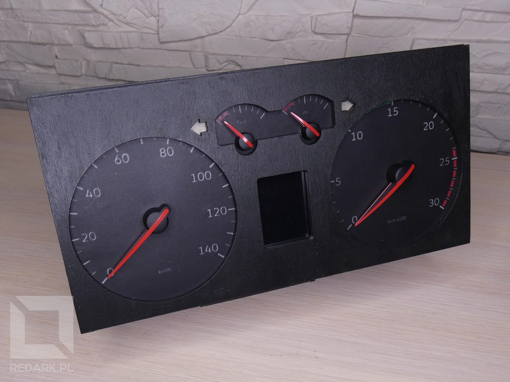
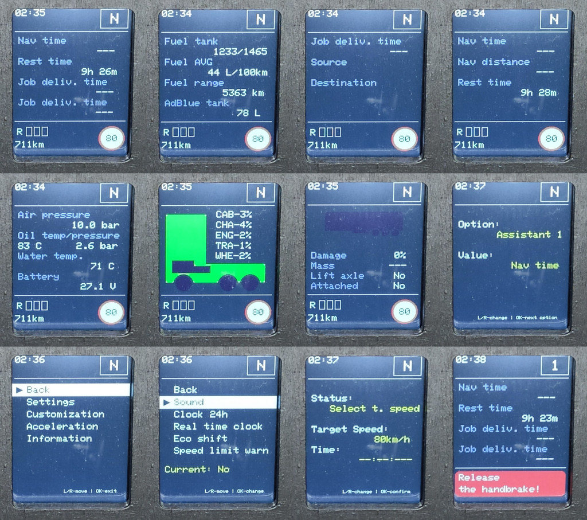
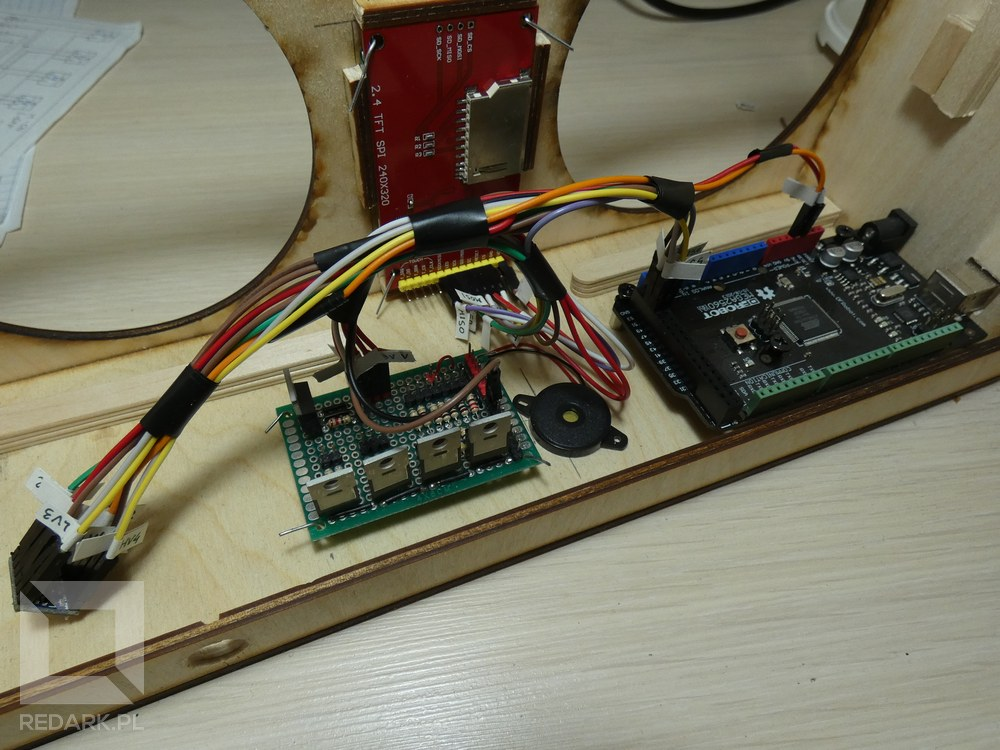
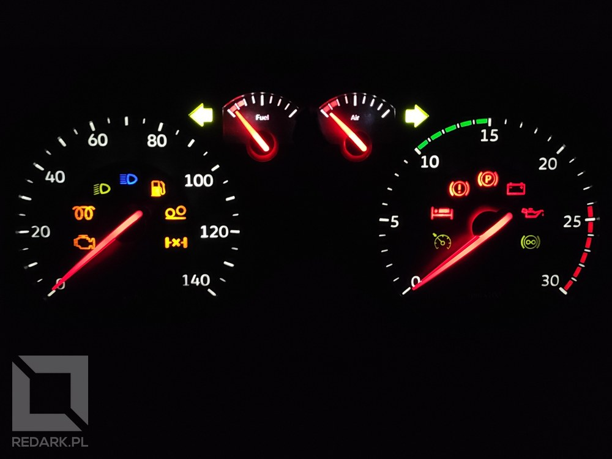
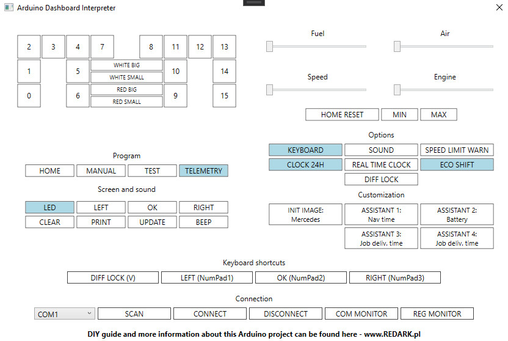

# DIY-Arduino-Dashboard

This is my first DIY project powered by Arduino. It is a handmade truck instrument cluster for SCS Software games - Euro Truck Simulator 2 and American Truck Simulator.

## Features

 1. 16 multi-color LED indicators
 2. 5-zone backlight with brightness adjustment
 3. 4 stepper motors
 4. 2.4 inch display with interactive on-board computer
 5. Dedicated wood case cutted by laser
 6. Handmade gauge faces

## Article

More informations about this project you can find on my website [REDARK.pl](https://redark.pl). Use the link below to go to it:

EN: [DIY Arduino Dashboard for ETS/ATS game](https://redark.pl/diy-arduino-dashboard-ets-ats-eng)

PL: [DIY Arduino Dashboard dla gier ETS/ATS](https://redark.pl/diy-arduino-dashboard-ets-ats)

## Videos

 1. Function presentation: https://youtu.be/KW6sZINNi9Y
 2. Example trip in Euro Truck Simulator 2: https://youtu.be/NMoZSP29ytk

*(Polish and English subtitles available)*

## Gallery

